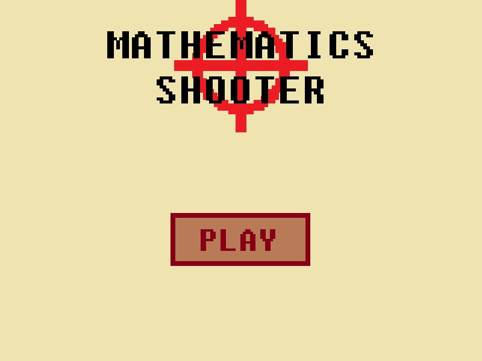
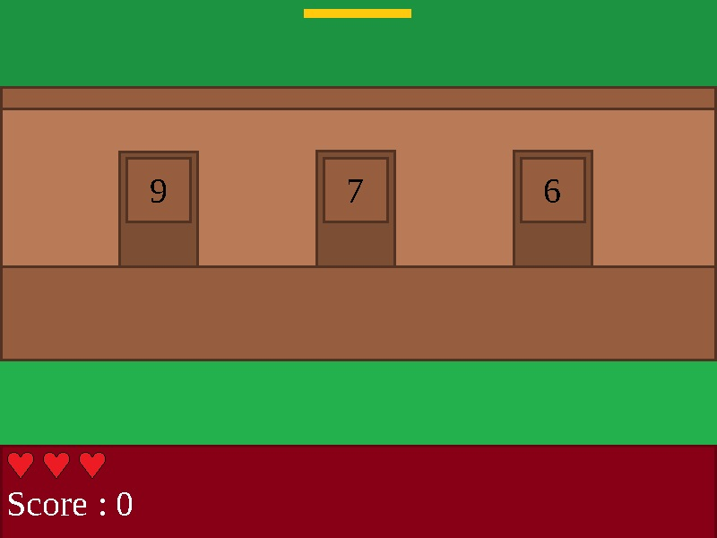

# Python-Mathematics-Shooter

This is a speed shooter game. You will have to choose on which number you will shoot.
## Features
- 2 game modes
## Installation
1. Download the repository by clicking on `Code > Download ZIP`
2. Extract the ZIP file
3. Run `main.pyw`
## Requirements
- Python 3.7
- Python tkinter library
- Python random library
- Python time library
## Game Captures
